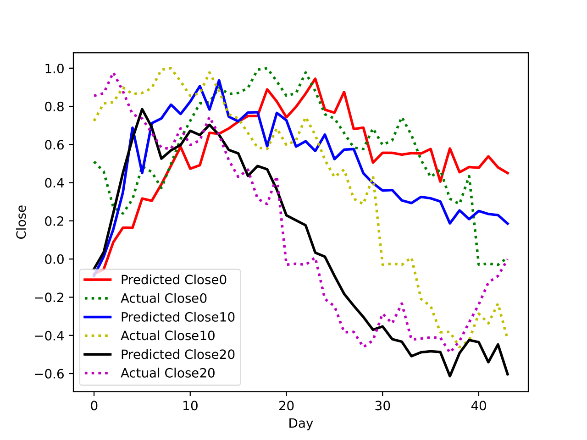

[[Japanese](README.md)/English]

# Introduction: Long Short-Term Memory (LSTM) Network

## Overview
This project is an introductory example of applying the Long Short-Term Memory (LSTM) model to predict univariate time series data using PyTorch. It primarily focuses on predicting stock prices, providing a fundamental understanding of LSTM and its implementation steps.


## Task Analysis
In the modeling and forecasting of time series data, Recurrent Neural Networks (RNNs) have become powerful tools. Among them, LSTM (Long Short-Term Memory) excels in learning short-term and long-term dependencies, making it widely used. This article focuses on the basic principles of LSTM, the implementation procedure using PyTorch, and how to apply LSTM to real data.


## Requirements

- python==3.11.5
- pytorch==2.0.1
- pytorch-cuda==11.8
- numpy==1.25.2
- matplotlib==3.8.0
- pandas==2.0.3


## Project Structure
- `generate_data.py`：File responsible for loading and preprocessing the dataset
- `training.py`：File for training and evaluating the LSTM model.
- `models.py`: File containing the definition and implementation of the LSTM model

## Training
Change the path in generate_data.py to determine the dataset you have. The dataset used here was about 10 years of Amazon stock investment. Then, customize the comments in TensorBoard according to your preferences. Run python -m training.py in the terminal to start training.

In your terminal, initiate training by running the following command:
```bash
python -m training.py
```

## Data Processing
A properly sized window containing input data `(past values)` and target data `(future values)` is generated. self.sequence_length specifies the number of past steps that the model considers. `self.future_time_steps` specifies the number of future data the model predicts.

The x shape is changed to `(batch_size, input_size, sequence_length)`. y is changed to `(batch_size, self.sequence_length + future_time_steps) `if includeInput is true, otherwise `(batch_size, future_time_steps)`.


## Training Loop
To train the LSTM model, the choice of loss function and optimization method is crucial. For general regression tasks, Mean Squared Error (MSE) is commonly used. During training, the model is optimized using backpropagation and gradient descent.


### Performance Metrics
After training, the model is evaluated. Metrics such as RMSE (Root Mean Squared Error), MAE (Mean Absolute Error), R² (Coefficient of Determination), etc., are used to compare predictions with actual values. This function allows for deeper analysis of each metric.


## Models
LSTM was developed to address the vanishing gradient problem faced by regular RNNs. This network introduces gates (input gate, forget gate, output gate) to enable the retention of long-term memory and selective information filtering. This makes LSTM more capable of learning long-term dependencies.

## Conclusion

Using the trained model, we predicted future stock price trends. The accuracy of the predictions was evaluated using test data. We used different evaluation metrics to assess the model's performance.

Unfortunately, the results were not satisfactory, the model is not able to follow the trends and make accurate predictions as can be seen in the graph below. However, there is room for improvement using feature engineering or using other models.




For more details, please refer to the project's files and code. If you have any questions or suggestions, feel free to reach out.

## Author
[aipracticecafe](https://github.com/deeplearningcafe)

## References
https://github.com/pytorch/examples/blob/main/time_sequence_prediction/README.md

## LICENSE
This project is licensed under the MIT license. Details are in the [LICENSE.md](LICENSE) file.